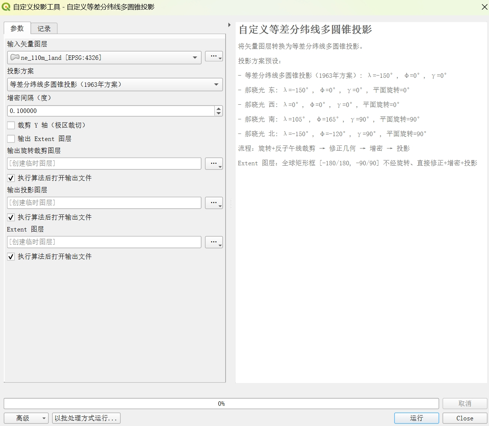

> 🌐 中文 | [English](README.en.md)

# 等差分纬线多圆锥投影（1963 年方案 & 郝晓光方案）

## 概述

本项目实现了一套用于**等差分纬线多圆锥投影**的 QGIS 数据处理工具链。

核心流程为：**球面旋转 → 反子午线裁剪 → 几何修正 → 增密 → 投影**。

主要功能：

- 将 D3-geo 的球面旋转和反子午线裁剪算法移植到 Python
- 提供 QGIS Processing 工具箱脚本，无缝集成到 QGIS 工作流
- 支持矢量图层的旋转、裁剪、投影全流程批处理
- 包含面积/距离变化检测的质量检查工具

## 项目结构

```
├── qgis_d3_geo/                # Python 包：D3-geo 算法移植 + QGIS 工具
│   ├── __init__.py             # 包入口，导出 rotate / clip / process 等函数
│   ├── d3_geo.py               # D3-geo 旋转与裁剪算法的纯 Python 实现
│   └── qgis_tool.py            # QGIS 图层处理工具（process_layer / process_file）
├── test_data/                  # 测试数据（Natural Earth 110m 全球陆地轮廓）
│   └── ne_110m_land.*          # 来自 Natural Earth 的 1:110m 全球陆地矢量
├── check_rotation.py           # 批量检查脚本：旋转前后面积/顶点距离对比 + JPG 输出
├── process_file.py             # 单文件处理脚本：旋转 + 反子午线裁剪
├── script_template.py          # QGIS Processing 脚本模板（完整投影工具）
└── README.md
```

## 依赖

### Python 包（纯算法部分）

无需额外依赖，仅使用标准库 `math`。

### QGIS 工具（qgis_tool.py / script_template.py）

- [QGIS](https://qgis.org/)（测试版本：3.40.10-Bratislava）
- 需要 QGIS 内置的 Python 环境（`python-qgis-ltr.bat` 或 QGIS Processing Framework）

## 快速开始

### 1. 处理单个矢量文件

编辑 [process_file.py](process_file.py) 中的输入路径和旋转参数，然后运行：

```batch
"D:\QGIS 3.40.10\bin\python-qgis-ltr.bat" process_file.py
```

示例将 `test_data/ne_110m_land.shp` 绕经度旋转 45°，输出到 `ne_110m_land_rotated_+0_+45_+0.shp`。

### 2. 批量检查旋转质量

编辑 [check_rotation.py](check_rotation.py) 中的输入路径和旋转角度组合，然后运行：

```batch
"D:\QGIS 3.40.10\bin\python-qgis-ltr.bat" check_rotation.py
```

脚本会扫描多个旋转角度组合，计算每个要素旋转前后的面积变化和顶点位移，并输出 JPG 对比图。

### 3. 在 QGIS Processing 中使用

1. 将[qgis_d3_geo](qgis_d3_geo)文件夹和[script_template.py](script_template.py)脚本复制到QGIS脚本工具路径`\AppData\Roaming\QGIS\QGIS3\profiles\default\processing\scripts`
2. 打开 QGIS，工具将出现在**工具箱 → 脚本**中，可像普通 QGIS 算法一样调用


## 核心算法

### 球面旋转

基于 D3-geo 实现的三轴旋转（经度 λ、纬度 φ、翻滚角 γ），将球面坐标绕三个轴依次旋转，使感兴趣区域居中。

### 反子午线裁剪

旋转后，原本在反子午线（±180°）附近连续的几何体可能被撕裂。算法沿反子午线裁剪并重建几何拓扑，确保后续投影正确。

### 等差分纬线多圆锥投影（1963年方案）

- 中央经线和赤道保持正交
- 纬线为对称于赤道的同心圆弧，圆心位于中央经线上
- 经线亦为对称于中央经线的曲线，经线间隔随离中央经线距离增大按等差递减
- 南北极点变形为两条对称的弧线，长度为赤道投影的一半（通常被图廓截掉）
- 中国位于地图中央附近，领土变形在10%之内

### 广义等差分纬线多圆锥投影（郝晓光方案）

- 使用5次方程拟合1963年方案的3次样条函数
- 设定了4种旋转角度配置，适用于东西南北四种图幅
- 南半球版投影经常用于竖版世界地图

> 投影实现参考 [Ishisashi的D3实现](https://mrhso.github.io/IshisashiWebsite/projection/)。

## 许可

本项目中的源代码采用 MIT 许可证。测试数据来自 [Natural Earth](https://www.naturalearthdata.com/)，属于公共领域。
